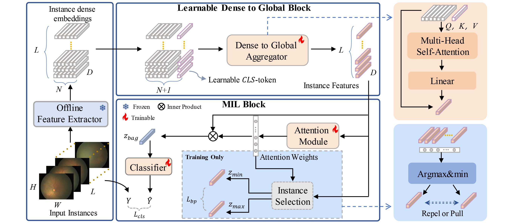

## Multiple Instance Learning with Parameter-Efficient Foundation Model Adaptation for Neonatal Retinal Screening

This is the code implementation of Multiple Instance Learning with Parameter-Efficient Foundation Model Adaptation for Neonatal Retinal Screening.
Our code is built on the basis of MMClassification.

MMClassification is an open source object detection toolbox based on PyTorch. It is a part of the OpenMMLab project developed by [Multimedia Laboratory, CUHK](http://mmlab.ie.cuhk.edu.hk/).

## Methodological Overview



## Datasets

We present the Neonatal Fundus Images (NFI) dataset, consisting of 115,621 retinal images collected from 8,886 subjects, which is the largest among all datasets. Therefore, training models on our dataset contributes significantly to enhancing their generalizability. This dataset was collected from Hunan Provincial Maternal and Child Health Hospital with ethical approval (LYF20230220). Each image was captured using the Retcam~3 imaging system, with resolutions of $1600 \times 1200$ pixels. Multiple retinal images were taken from each subject at different angles. The dataset includes class labels determined by professional ophthalmologists based on a series of retinal images from the subjects, categorized into Normal, Retinal Hemorrhage (RH), and Retinopathy of Prematurity (ROP). To ensure the utmost accuracy and consistency, the classification process involved the collective scrutiny of multiple medical professionals, each specializing in ophthalmology. We randomly divided the 8,886 subjects into the training set (train), validation set (val), and test set (test) with a ratio of 6:1:1.

## Key Configuration Files

* LD2G-MIL with Gated-ABMIL baseline:
  * `config/_nfi_/LD2G-MIL.py`
* LD2G-MIL with DSMIL baseline:
  * `config/_nfi_/LD2G-MIL_DSMIL.py`

## Environment Configuration

```
conda create -n mmcls-nfi python=3.7 -y
conda activate mmcls-nfi

# cuda10
conda install pytorch==1.8.0 torchvision==0.9.0 torchaudio==0.8.0 cudatoolkit=10.2 -c pytorch -y
pip install mmcv-full==1.3.18  -f https://download.openmmlab.com/mmcv/dist/cu102/torch1.8.0/index.html -i https://pypi.douban.com/simple/

# cuda 11
conda install pytorch==1.8.0 torchvision==0.9.0 torchaudio==0.8.0 cudatoolkit=11.1 -c pytorch -c conda-forge -y
pip install mmcv-full==1.3.18  -f https://download.openmmlab.com/mmcv/dist/cu111/torch1.8.0/index.html -i https://pypi.douban.com/simple/

cd mmcls-nfi
chmod u+x tools/*
chmod u+x tools/*/*
pip install -r requirements.txt -i https://pypi.douban.com/simple/
pip install -v -e .  -i https://pypi.douban.com/simple/
```
